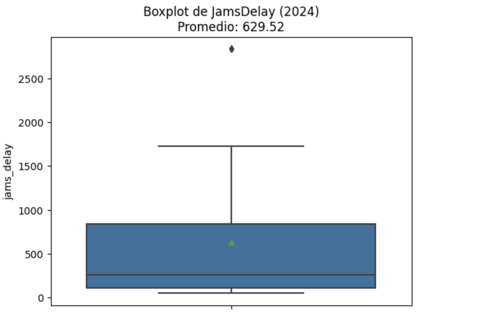
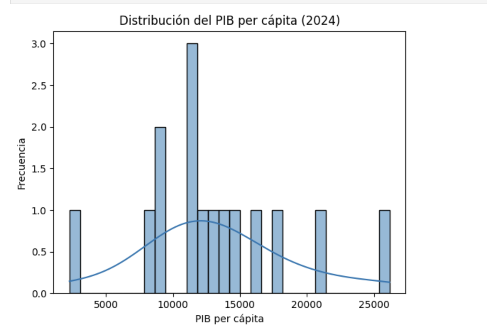
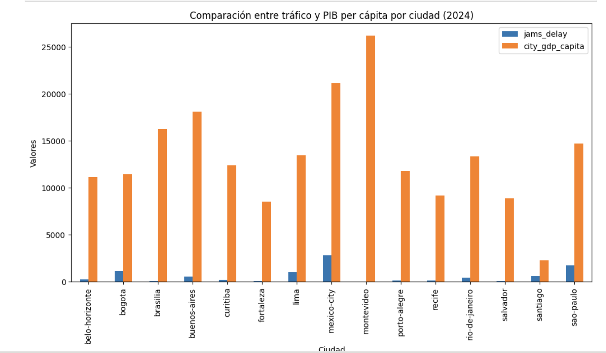

# Urban Mobility & Economic Productivity Analysis

## Project Overview
This project analyzes the relationship between traffic congestion and economic productivity across Latin American cities using real-world datasets.

## Business Objective
The goal of this project was to understand how urban mobility patterns impact economic productivity and identify insights that support data-driven decision-making.

## Tools & Technologies
- Python
- Pandas
- Data Cleaning
- Data Visualization
- Excel

## Process
- Cleaned and merged multiple datasets (traffic and economic data)
- Standardized column names using snake_case
- Performed exploratory data analysis (EDA)
- Aggregated traffic metrics by city
- Analyzed relationships between congestion and GDP per capita

## Key Insights
- Cities with higher traffic congestion show patterns linked to lower efficiency
- Significant variability exists across cities in both congestion and economic indicators
- Outliers in traffic delay highlight potential infrastructure challenges

## Sample Visualizations

### Traffic Delay Distribution

### GDP per Capita Distribution

### Traffic vs Economic Comparison

## Skills Demonstrated
- Data Cleaning
- Exploratory Data Analysis (EDA)
- Python / Pandas
- Data Visualization
- Business Analysis
